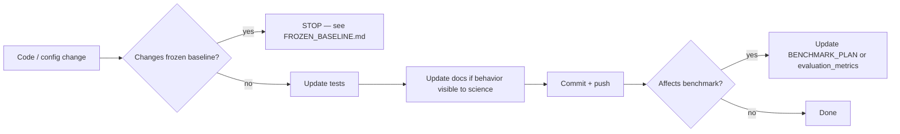

# Scientific workflow

How to keep **software**, **benchmark experiments**, **repository documentation**, and the **living manuscript** synchronized as SnatchPhaseBench evolves.

**External knowledge base (read-only):** [`SnatchPhaseBench_Literature_Foundation.md`](../../SnatchPhaseBench_Literature_Foundation.md)

---

## 1. Principles

1. **Evidence before prose** — never populate manuscript numbers until the experiment is run, logged, and committed.
2. **Single sources of truth** — each fact type has one canonical document; others link to it.
3. **Frozen baseline** — thesis LSTM pipeline stays untouched until checkpoint validated (`docs/FROZEN_BASELINE.md`).
4. **Distributed docs** — scientific knowledge lives in topic documents, not one monolithic file.
5. **Citation integrity** — verify every reference personally before BibTeX entry (literature foundation READ THIS FIRST).

---

## 2. Canonical document map

| Decision type | Canonical document | Consumers |
|---------------|-------------------|-----------|
| What the project claims scientifically | `docs/research_design.md` | Manuscript intro, grant text |
| What to run and in what order | `docs/benchmark/BENCHMARK_PLAN.md` | Code, experiments, paper Methods |
| Metric definitions | `docs/evaluation_metrics.md` | Code, paper Protocol, eval modules |
| Dataset facts (verified) | `docs/dataset/dataset.md` | Paper Dataset, benchmark configs |
| Reproduction status (frozen) | `docs/reproduction/REPRODUCTION_SUMMARY.md` | Paper Results (baseline row only) |
| Reviewer risks | `docs/paper/REVIEWER_CHECKLIST.md` | Planning, Discussion, rebuttals |
| Manuscript actions | `docs/paper/PAPER_TODO.md` | Writing sprints |
| Manuscript completion | External `~/papers/snatch-phase-bench/paper/WRITING_STATUS.md` | Contributors |
| Literature vs repo gaps | `docs/literature/GAP_ANALYSIS.md` | Planning |
| Venue and release | `docs/release/PUBLICATION_STRATEGY.md` | Submission decisions |
| Software layout | `docs/project_architecture.md` | Developers |

---

## 3. Change workflow by activity

### 3.1 Software change (code/config)

**Documentation updates required when:**

- New model registered → `BENCHMARK_PLAN.md`, `PAPER_TODO.md` EXP-* item
- New metric implemented → `evaluation_metrics.md`, paper Protocol if reporting
- Split logic changes → `dataset/dataset.md`, tests, **never silently**

### 3.2 Benchmark experiment completed

1. Run under YAML config in `configs/benchmark/` (future) with fixed seed
2. Save outputs to `outputs/benchmark/<model>/<timestamp>/`
3. Export metrics JSON to `docs/reproduction/reports/` or `outputs/benchmark/`
4. Update `docs/paper/PAPER_TODO.md` — mark EXP-* done
5. Populate corresponding LaTeX table/figure (**numbers only from this run**)
6. Update external `~/papers/snatch-phase-bench/paper/WRITING_STATUS.md` completion %
7. Update `docs/paper/REVIEWER_CHECKLIST.md` if risk mitigated
8. Commit: `Report <model> benchmark results on test split`

### 3.3 Documentation / literature integration

1. Read relevant section of external literature foundation (do not copy verbatim into repo)
2. Integrate distilled guidance into target doc (research_design, benchmark, etc.)
3. Update `GAP_ANALYSIS.md` if gap closed or new gap found
4. Link external file from `docs/literature/README.md`
5. Commit: `Document <topic> from literature foundation`

### 3.4 Manuscript writing

1. Check `PAPER_TODO.md` for next action ID
2. Write only claims supported by canonical docs or committed experiment outputs
3. Update `WRITING_STATUS.md`
4. Commit: `Write <section> with verified <content>`

---

## 4. Synchronization matrix

When this changes… | Also update…
---|---
`evaluation/metrics/*.py` | `docs/evaluation_metrics.md`, external `paper/sections/05_experimental_protocol.tex`
`configs/baseline_lstm.yaml` (frozen — avoid) | `docs/FROZEN_BASELINE.md`, paper `tab:lstm_hyperparams`
New benchmark model | `models/registry.py`, `BENCHMARK_PLAN.md`, `PAPER_TODO.md`, external `paper/sections/06_results.tex`
Dataset rebuild verified | `REPRODUCTION_SUMMARY.md`, `dataset/dataset.md`
Phase ontology decision | `dataset/dataset.md`, `GAP_ANALYSIS.md`, paper `tab:phase_taxonomy`, `PAPER_TODO EXP-12`
Citation verified | `bibliography.bib`, remove `\todosource`, `WRITING_STATUS` bibliography table
Checkpoint validated | `REPRODUCTION_SUMMARY.md`, `tab:baseline_reproduction`, `REVIEWER_CHECKLIST` #8
B0 baseline implemented | `BENCHMARK_PLAN.md`, `REVIEWER_CHECKLIST` #1, benchmark table

---

## 5. Gates (do not skip)

| Gate | Condition | Unblocks |
|------|-----------|----------|
| **G0** | Original `best_model.pt` validates thesis metrics | Learned benchmark training, baseline results prose |
| **G1** | Phase ontology reconciled (5 vs 7) | Final Methods/Dataset claims |
| **G2** | B0 + boundary metrics implemented | Core benchmark credibility |
| **G3** | B1–B3 complete | Main benchmark comparison table |
| **G4** | Legal clearance | Public release, dataset overview figures with video |

---

## 6. Commit message conventions

Use English, one coherent milestone per commit:

- `Integrate <topic> into research documentation`
- `Add <model> to benchmark registry (stub|implementation)`
- `Report <experiment-id> results — populate <table-id>`
- `Update reviewer checklist: mitigate <risk-id>`
- `Write manuscript <section> from verified <source>`

Always push to `origin/main` after each milestone (project policy).

---

## 7. Anti-patterns (avoid)

- Copying the entire literature foundation into the repo
- Inventing citations or results in LaTeX
- Changing frozen baseline modules for benchmark convenience
- Populating Results tables from thesis JSON without checkpoint validation
- Claiming five-phase ontology while dataset has seven labels without mapping
- Running clip-random splits

---

## 8. Related documents

- [`literature/README.md`](literature/README.md)
- [`literature/GAP_ANALYSIS.md`](literature/GAP_ANALYSIS.md)
- [`benchmark/BENCHMARK_PLAN.md`](benchmark/BENCHMARK_PLAN.md)
- [`paper/PAPER_TODO.md`](paper/PAPER_TODO.md)
- [`paper/REVIEWER_CHECKLIST.md`](paper/REVIEWER_CHECKLIST.md)
- [`FROZEN_BASELINE.md`](FROZEN_BASELINE.md)
- [`paper/MANUSCRIPT_LOCATION.md`](paper/MANUSCRIPT_LOCATION.md)
- [`../paper/WRITING_STATUS.md`](../../paper/WRITING_STATUS.md) — external manuscript status (from repo: `../paper/`)
