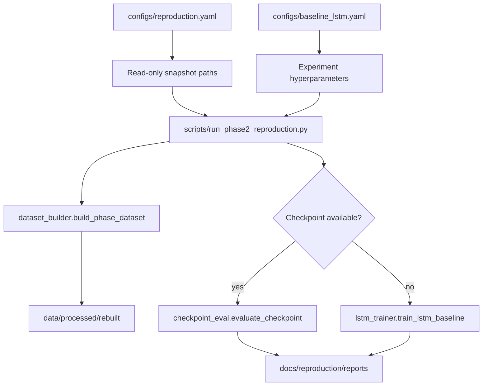

# Project Architecture

SnatchPhaseBench is organized as a **src-layout** Python package with configuration-driven experiments and a **frozen thesis baseline**.

## Directory layout

```text
configs/                 YAML experiment and reproduction paths
docs/                    Human-readable documentation (not code)
../paper/                Living LaTeX manuscript (outside Git — see docs/paper/MANUSCRIPT_LOCATION.md)
scripts/                 CLI entry points
src/snatch_phase_bench/
  config.py              Snapshot path loading (reproduction.yaml)
  data/                  Dataset build (frozen), loaders, paths
  models/                Model interface, registry, LSTM (frozen core)
  training/              Training loops (frozen LSTM trainer)
  evaluation/            Metrics (extensible) + frozen checkpoint eval
  experiments/           Future config-driven runner
  reproduction/          Phase 2 audit utilities (read-only snapshot)
  utils/                 Logging, seeds
tests/                   Automated tests
data/                    Gitignored local tensors (processed/rebuilt)
outputs/                 Gitignored experiment artifacts
```

## Execution flow



**Frozen path:** Phase 2 reproduction script and modules listed in `docs/FROZEN_BASELINE.md`.

**Future path:** `experiments/runner.py` + model registry for GRU/TCN/etc. (not enabled yet).

## Data flow

1. **Read-only snapshot** (`Paper_TFM-main`): annotations, keypoints, split JSON, baseline meta.
2. **Build** (frozen logic): sliding windows → `X.npy`, `y.npy`, `meta.csv`.
3. **Load** (`data/loaders.py`): validate shapes and label consistency.
4. **Train/eval** (frozen LSTM): athlete-level masks from split JSON.

No writes to the student snapshot.

## Model flow (benchmark target)

Three stages — do not conflate (literature Part 4.2):

```text
[Stage 1] Pose estimation (MediaPipe)     →  keypoints CSV
[Stage 2] Skeleton encoding (optional)    →  CTR-GCN / PoseC3D / raw
[Stage 3] Temporal segmentation           →  per-frame phase labels
```

Current code (frozen baseline path):

```text
TemporalSegmentationModel (interface)
        │
        └── LSTMBaselineModel (adapter)     → window-level labels (thesis)
                 └── LSTMClassifier (frozen architecture)
```

Future benchmark models register in `models/registry.py` without editing the LSTM trainer.
See [`docs/benchmark/BENCHMARK_PLAN.md`](benchmark/BENCHMARK_PLAN.md) for B0–A3 tiers.

## Evaluation flow

| Level | Module | Baseline uses? |
|-------|--------|----------------|
| Window | `evaluation/metrics/window.py` | **Yes** (frozen) |
| Frame | `evaluation/metrics/frame.py` | Future benchmark |
| Segment | `evaluation/metrics/segment.py` | Future benchmark |
| Boundary | `evaluation/metrics/boundary.py` | TODO |

`evaluation/evaluator.py` orchestrates multiple levels for future experiments.

## Configuration

- `configs/reproduction.yaml` — snapshot paths, output dirs, expected metrics.
- `configs/baseline_lstm.yaml` — thesis hyperparameters (frozen values).

Load via `experiments/config_loader.load_experiment_config()`.

## Design principles

- **Frozen baseline first** — no silent changes to thesis pipeline.
- **Benchmark ≠ thesis baseline** — LSTM is reproduction artifact; B0–B3 follow [`benchmark/BENCHMARK_PLAN.md`](benchmark/BENCHMARK_PLAN.md).
- **Small modules** — metrics, loaders, registry are independent.
- **Determinism** — seed 42 in baseline config; logging to stdout.
- **No over-abstraction** — single LSTM adapter, no factory framework beyond registry.
- **Scientific sync** — see [`SCIENTIFIC_WORKFLOW.md`](SCIENTIFIC_WORKFLOW.md).
